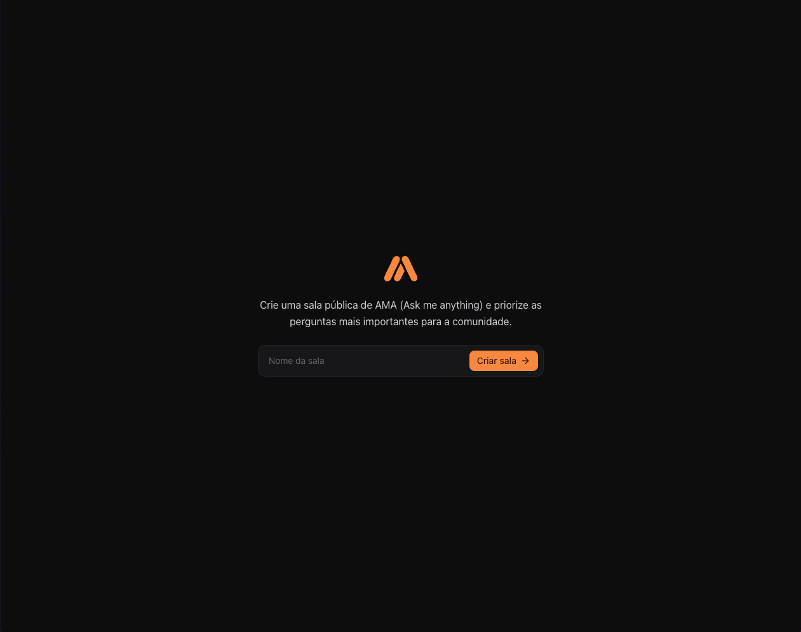

# Ask Me Anything

A simple app to ask me anything. 

Create rooms, anwser questions, and get answers.

## Screenshots

### How to run

1. Clone the repo
2. Install dependencies with `npm install`
3. Run `npm run dev`
4. Open `http://localhost:5173` in your browser

### Tech Stack

- React 19
- TypeScript
- React Query
- Tailwind CSS
- Vite
- Typescript
- Biome
- Sonner
- React Router Dom
- Lucide React